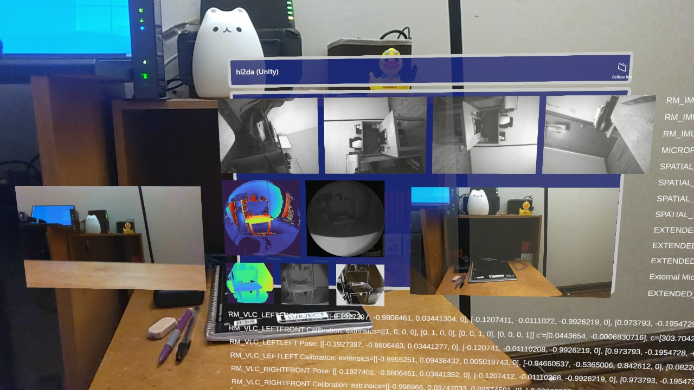

# HoloLens 2 Data Acquisition

Unified HoloLens 2 plugin for acquiring sensor data.
The plugin enables access to most of the HoloLens sensors through a common interface and allows associating data from multiple streams via timestamps.
It is compatible with Unity, Unreal, and native UWP applications.

**Supported interfaces**

- Research Mode Visible Light Cameras (640x480 @ 30 FPS, Grayscale)
  - Left Front
  - Left Left
  - Right Front
  - Right Right
- Research Mode Depth
  - AHAT (512x512 @ 45 FPS, 16-bit Depth + 16-bit AB)
  - Long Throw (320x288 @ 5 FPS, 16-bit Depth + 16-bit AB + 8-bit Sigma)
- Research Mode IMU
  - Accelerometer
  - Gyroscope
  - Magnetometer
- Front Camera (Configurable resolution and framerate, NV12, See [here](etc/pv_configurations.txt) for a list of supported configurations)
- Microphone (2 or 5 channels @ 48000 Hz, 32-bit Float)
- Spatial Input (30 Hz)
  - Head Tracking
  - Eye Tracking
  - Hand Tracking
- Extended Eye Tracking (30, 60, or 90 FPS)
- Extended Audio (Microphone + Application Audio)
  - Internal Microphone mirror
  - External USB-C Microphone
- Extended Video
  - Internal Front Camera mirror
  - External USB-C Camera

**Additional features**

- Per-frame pose for the Research Mode sensors, Front Camera, and Extended Eye Tracking.
- Access to Research Mode sensor extrinsics and image-camera space conversions (intrinsics, undistort).
- Per-frame [metadata](https://github.com/jdibenes/hl2da/blob/021ca4360d033c317d28e19dbb4d6353dcf9a5e2/hl2da/hl2da/stream_rm.cpp#L21) for RM VLC sensors.
- Per-frame intrinsics and [metadata](https://github.com/jdibenes/hl2da/blob/021ca4360d033c317d28e19dbb4d6353dcf9a5e2/hl2da/hl2da/stream_pv.cpp#L36) for the Front Camera.
- RGB-D alignment [example](hl2da_unity/Assets/Scripts/rgbd_align.cs). (Experimental).
- Configurable focus, white balance, and exposure for the Front Camera.
- Support for Mixed Reality Capture (holograms in Front Camera video).
- Support for Shared capture for Front Camera and Extended Video.
- Frame timestamps can be converted to [Windows FILETIME](https://learn.microsoft.com/en-us/windows/win32/api/minwinbase/ns-minwinbase-filetime) (UTC) for external synchronization.
- Support for converting NV12 and YUY2 video streams to RGBA or BGRA.

## Preparation

Before using the plugin configure your HoloLens as follows:

1. Update your HoloLens: Settings -> Update & Security -> Windows Update.
2. Enable developer mode: Settings -> Update & Security -> For developers -> Use developer features.
3. Enable device portal: Settings -> Update & Security -> For developers -> Device Portal.
4. Enable research mode: Refer to the Enabling Research Mode section in [HoloLens Research Mode](https://docs.microsoft.com/en-us/windows/mixed-reality/develop/advanced-concepts/research-mode).

Please note that enabling Research Mode on the HoloLens increases battery usage.

## Unity plugin

For capturing sensor data from a Unity application.
A sample Unity project (2020.3.42f1) can be found in the [hl2da_unity](hl2da_unity) directory.
Refer to the [HoloLens2DA](hl2da_unity/Assets/Scripts/HoloLens2DA.cs) script for how to use the plugin in Unity.

**Build and run the sample project**

1. Open the project in Unity. If the MRTK Project Configurator window pops up just close it.
2. Go to Build Settings (File -> Build Settings).
3. Switch to Universal Windows Platform.
4. Set Target Device to HoloLens.
5. Set Architecture to ARM64.
6. Set Build and Run on Remote Device (via Device Portal).
7. Set Device Portal Address to your HoloLens IP address (e.g., https://192.168.1.7) and set your Device Portal Username and Password.
8. Click Build and Run. Unity may ask for a Build folder. You can create a new one named Build.

**Adding the plugin to an existing project**

1. Download the [latest plugin zip file](https://github.com/jdibenes/hl2da/releases) and extract the Assets folder into your Unity project folder.
2. In the Unity Editor configure the hl2da and Eye Tracking DLLs as UWP ARM64.
    1. In the Project window navigate to Assets/Plugins/WSA, select the DLL, and then go to the Inspector window.
    2. Set SDK to UWP.
    3. Set CPU to ARM64.
    4. Click Apply.
3. Enable the following capabilities (Edit -> Project Settings -> Player -> Publishing Settings):
    - Webcam
    - Microphone    
    - Spatial Perception
    - Gaze Input

## Unreal plugin

For capturing sensor data from an Unreal application.
A sample Unreal project (4.27.2) can be found in the [hl2da_unreal](hl2da_unreal) directory.
Refer to the [hl2da_ipl](hl2da_unreal/Source/hl2da_unreal/hl2da_ipl.cpp), [vlc_viewer](hl2da_unreal/Source/hl2da_unreal/vlc_viewer.cpp), [ahat_viewer](hl2da_unreal/Source/hl2da_unreal/ahat_viewer.cpp), [longthrow_viewer](hl2da_unreal/Source/hl2da_unreal/longthrow_viewer.cpp), [pv_viewer](hl2da_unreal/Source/hl2da_unreal/pv_viewer.cpp), and [ev_viewer](hl2da_unreal/Source/hl2da_unreal/ev_viewer.cpp) classes for how to use the plugin in Unreal.

**Build and run the sample project**

1. Open the project in Unreal and rebuild all missing modules. Ignore the Level_BuiltData error.
2. Open Project Settings (Edit -> Project Settings). Navigate to Platforms -> HoloLens. Under Packaging -> Signing Certificate, click Generate New. In the Create Private Key Password window that appears click None. Close Project Settings.
3. Package the project for HoloLens (File -> Package Project -> HoloLens). Unreal may ask for a destination folder. You can create a new one named Package.
4. Install the hl2da_unreal.appxbundle (generated in the Package/HoloLens folder) on your HoloLens.
5. Run the hl2da unreal app (located in the All apps list).

**Adding the plugin to an existing project**

1. Download the [latest plugin zip file](https://github.com/jdibenes/hl2da/releases) and extract the Plugins folder into your Unreal project folder.
2. Enable the hl2da plugin (Edit -> Plugins). Restart the Editor if prompted.
3. Add "hl2da" to PublicDependencyModuleNames in the project .Build.cs.
4. Enable the following capabilities (Edit -> Project Settings -> Platforms -> HoloLens):
   - Microphone
   - Webcam
   - Gaze Input
   - Spatial Perception
5. Add `+DeviceCapabilityList=backgroundSpatialPerception` to Config/HoloLens/HoloLensEngine.ini. See [here](hl2da_unreal/Config/HoloLens/HoloLensEngine.ini) for an example.

## Permissions

The first time an application using the plugin runs it will ask for the necessary permissions to access sensor data.
If there are any issues please verify that the application has access to:

- Camera (Settings -> Privacy -> Camera).
- Eye tracker (Settings -> Privacy -> Eye tracker).
- Microphone (Settings -> Privacy -> Microphone).
- User movements (Settings -> Privacy -> User movements).

## Build plugin from source

Building the plugin requires a Windows 10 machine.

1. [Install the tools](https://docs.microsoft.com/en-us/windows/mixed-reality/develop/install-the-tools).
2. Open the Visual Studio solution (sln file in the [hl2da](hl2da) folder) in Visual Studio 2022.
3. Set build configuration to Release ARM64. Building for x86 and x64 (HoloLens emulator), and ARM is not supported.
4. Build (Build -> Build Solution).

The plugin is in the hl2da\ARM64\Release\plugin folder.

## References

This project uses the HoloLens 2 Research Mode API, available at the [HoloLens2ForCV](https://github.com/microsoft/HoloLens2ForCV) repository.
This project is part of the [hl2ss](https://github.com/jdibenes/hl2ss) project.
